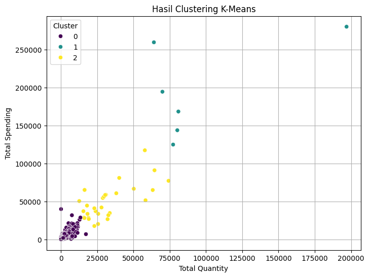

# Segmentasi Pelanggan E-Commerce dengan K-Means Clustering

Proyek ini bertujuan untuk melakukan segmentasi pelanggan dari dataset *Online Retail* berdasarkan perilaku belanja mereka. Segmentasi dilakukan menggunakan algoritma *unsupervised learning* **K-Means Clustering** untuk mengelompokkan pelanggan ke dalam beberapa klaster yang berbeda.

Hasil dari segmentasi ini diharapkan dapat membantu perusahaan dalam menyusun strategi pemasaran yang lebih efektif, personal, dan tepat sasaran.

## 📋 Deskripsi Dataset

- **Nama Dataset**: Online Retail
- **Sumber**: Dataset ini diperoleh dari dosen pengampu mata kuliah Data Mining, berisi transaksi dari perusahaan e-commerce di Inggris.
- **Dimensi**: Terdiri dari 541.909 baris data dan 8 kolom (atribut).
- **Atribut**: `InvoiceNo`, `StockCode`, `Description`, `Quantity`, `InvoiceDate`, `UnitPrice`, `CustomerID`, dan `Country`.

## ⚙️ Alur Kerja Proyek

Proses analisis data dalam proyek ini mengikuti alur kerja yang sistematis, mulai dari pembersihan data hingga evaluasi model.

1.  **Pembersihan Data (*Data Cleaning*)**:
    - Menghapus baris dengan `CustomerID` yang kosong.
    - Menghapus baris dengan `Quantity` atau `UnitPrice` bernilai negatif atau nol.
    - Menghilangkan data duplikat untuk menjaga kualitas analisis.

2.  **Transformasi Data (*Feature Engineering*)**:
    - Membuat fitur baru bernama `TotalPrice` yang merupakan hasil perkalian antara `Quantity` dan `UnitPrice`.

3.  **Agregasi Data**:
    - Mengelompokkan data berdasarkan `CustomerID` untuk menghitung total pembelian (`TotalQuantity`) dan total pengeluaran (`TotalSpending`) setiap pelanggan.

4.  **Normalisasi Data**:
    - Menyamakan skala fitur `TotalQuantity` dan `TotalSpending` menggunakan `StandardScaler` dari Scikit-learn agar keduanya memiliki kontribusi seimbang.

5.  **Penentuan Jumlah Klaster Optimal**:
    - Menggunakan **Metode Elbow** untuk menemukan jumlah klaster yang paling optimal. Berdasarkan analisis, jumlah klaster yang ideal adalah **3**.

6.  **Implementasi K-Means**:
    - Menerapkan algoritma K-Means dengan `n_clusters=3` untuk mengelompokkan pelanggan.

7.  **Evaluasi dan Visualisasi**:
    - Mengevaluasi kualitas klaster menggunakan **Silhouette Score**.
    - Memvisualisasikan hasil segmentasi dalam bentuk *scatter plot* untuk interpretasi yang lebih mudah.

## 📊 Hasil

- **Jumlah Klaster Optimal**: **3 Klaster** pelanggan berhasil diidentifikasi.
- **Skor Evaluasi**: Hasil pengelompokan dievaluasi dan mendapatkan **Silhouette Score** sebesar **0.9502**, yang menandakan bahwa klaster yang terbentuk sangat baik, padat, dan terpisah dengan jelas.
- **Visualisasi**: *Scatter plot* menunjukkan tiga kelompok pelanggan yang berbeda berdasarkan total kuantitas barang yang dibeli dan total pengeluaran mereka.



## 🚀 Cara Menjalankan Kode

1.  **Lingkungan**: Kode ini dikembangkan menggunakan **Google Colaboratory**.
2.  **Klon Repositori**:
    ```bash
    git clone [https://github.com/haerulyudaaditiya/Segmentasi-Pelanggan-KMeans.git](https://github.com/haerulyudaaditiya/Segmentasi-Pelanggan-KMeans.git)
    cd nama-repositori
    ```
3.  **Buka di Colab**: Unggah file notebook (`.ipynb`) ke Google Colab.
4.  **Upload Dataset**: Pastikan file `Online Retail.xlsx` diunggah ke lingkungan Colab saat diminta oleh skrip.
5.  **Jalankan Sel**: Jalankan semua sel kode secara berurutan dari atas ke bawah. Hasil akhir akan disimpan dalam file `hasil_clustering_online_retail.xlsx`.

## 💡 Saran Pengembangan

- **Penambahan Fitur**: Menambahkan fitur lain seperti **Recency** untuk analisis yang lebih komprehensif.
- **Perbandingan Algoritma**: Membandingkan hasil K-Means dengan algoritma clustering lain seperti DBSCAN atau Hierarchical Clustering.
- **Visualisasi Interaktif**: Mengembangkan *dashboard* interaktif untuk mempermudah interpretasi hasil oleh pengguna non-teknis.

## ✍️ Penulis

Penelitian dan kode ini dikerjakan oleh mahasiswa Program Studi S1 Teknik Informatika, Universitas Buana Perjuangan Karawang:
- **Haerul Yuda Aditiya**
- **Rendy Suwandi Saputra**
- **Toriq Ardiansya**